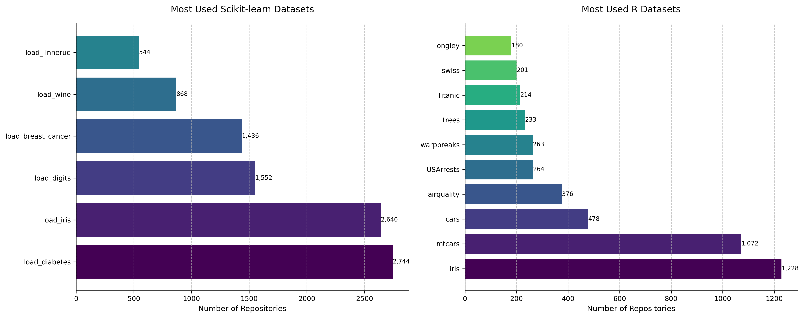

# toy-dataset-ranking
This repository allows users to estimate the popularity of "toy" datasets i.e. synthetic or real datasets that are typically used to quickly test visualisation or models.

## Setup
Clone the repository, navigate to it using your command line, and set up a virtual python environment (e.g. using conda). Activate your virtual environment and run 
```bash
pip install -r requirements.txt
```

Create a `.env` file in the root of the repository and set the value of the variable `GITHUB_TOKEN` to your personal access token. Instructions on how to obtain a fine-grained personal access token can be found [here](https://docs.github.com/en/authentication/keeping-your-account-and-data-secure/managing-your-personal-access-tokens#creating-a-fine-grained-personal-access-token).

Once the dependencies are installed and token is set then run the script using
```bash
python query_api.py
```

The output will be generated as a .csv file.

## Methodology
The popularity of a dataset e.g. [Iris](https://scikit-learn.org/1.5/auto_examples/datasets/plot_iris_dataset.html) is estimated by finding the number of repositories where the dataset is loaded. This is currently implemented for datasets within python sklearn and base R. The exact query can be found within `query_api.py`. Note that the search uses Github Search API and results may differ from Github's Blackbird UI search.

## Results on sklearn dataset
